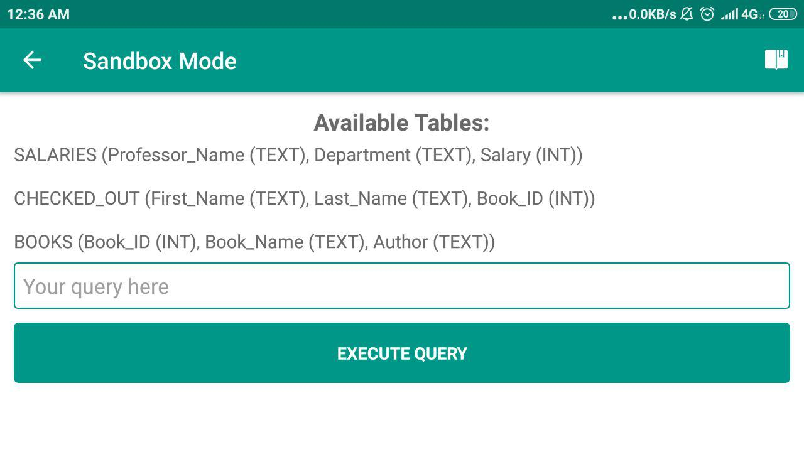
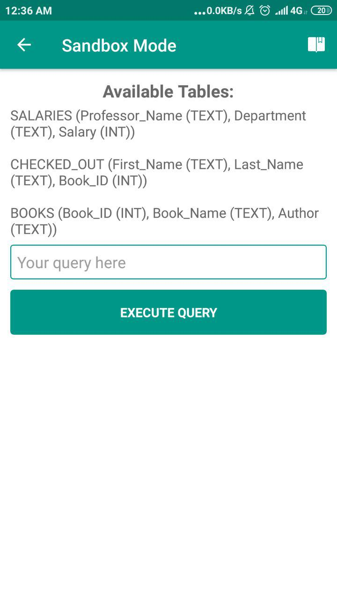
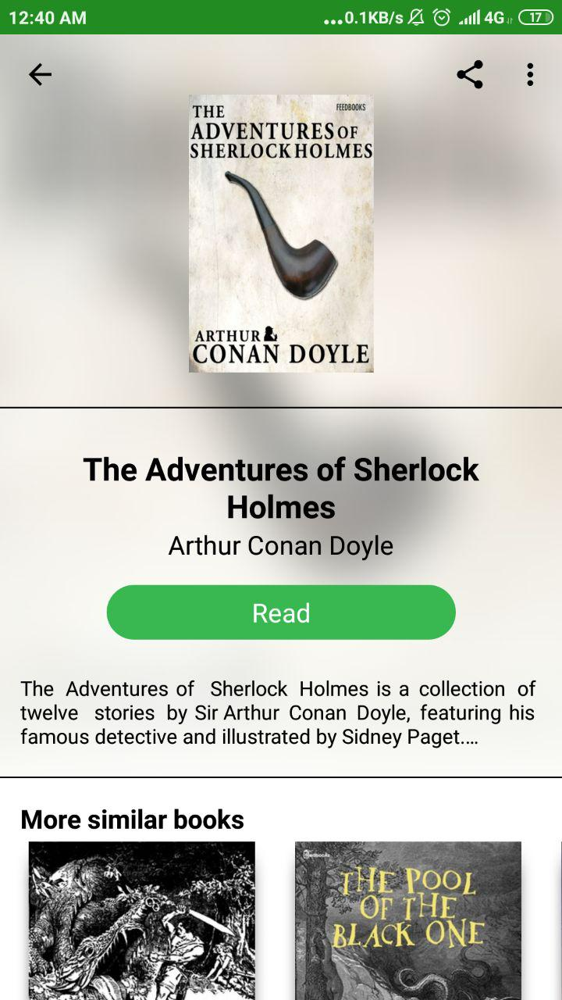

# AndroidStart2019

## Telegram group
https://t.me/joinchat/JnUVYxAe1Q7KnNWiNLuqbg

**Min requirements for final project**
 - [ ] minSdk 16
 - [ ] targetSdk28
 - [ ] 2 different flavor
 - [ ] min 3 activity
 - [ ] min 1 service
 - [ ] min 1 broadcustReceiver
 - [ ] min 1 request for critical permissions
 - [ ] work with local storage (SQLlite)
 - [ ] work with network
 - [ ] work with multiThred
 
 Additional: 
 - [ ] project available in repository
 - [ ] commit history show development process
 
 Advance:
 - [ ] unit an UI tests

**Home Task 1**

- [ ] Install and setup AndroidStudio
- [ ] Create project HelloWorld
- [ ] Create a repository with this project on Github, Gitlab or Bitbucket
- [ ] Add a link on a repository like-new issue to this repo.
- [ ] Read about GitFlow

**Home Task 2**
- [ ] Fork repository https://github.com/Kiolk/Calculator-.git
- [ ] Create develop branch
- [ ] Implemented all TODOs
- [ ] Add link on your repository in issue

**Home Task 3 - Copy me**

Need create layout that copy screen existing application.
Try use same fonts, size, padding.

### Basic
https://play.google.com/store/apps/details?id=randomappsinc.com.sqlpracticeplus&hl=en

- [ ] landscape

- [ ] portrait

 
### Normal
https://play.google.com/store/apps/details?id=com.shazam.android&hl=en

- [ ] landscape

- [ ] portrait

### Advance
https://play.google.com/store/apps/details?id=uk.free.books.read.listen&hl=en

- [ ] portrait

**Home Task 4 - Splash**
- [ ] create and implement correct splash screen
- [ ] on implemented [login screen](https://github.com/d1scret0/lesson3) add TextInputLayout for EditText 
- [ ] create custom view (compose or from scratch)

**Home Task 5 - ViewPager**
Dedline 25 November
- [ ] Implement example of ViewPager
- [ ] For ViewPager add tabs. 
- [ ] Implement logic for check and request all groups of dangerous permistions. Handle situation when user checked "Don't ask againe" - show dialog and open application settings.

